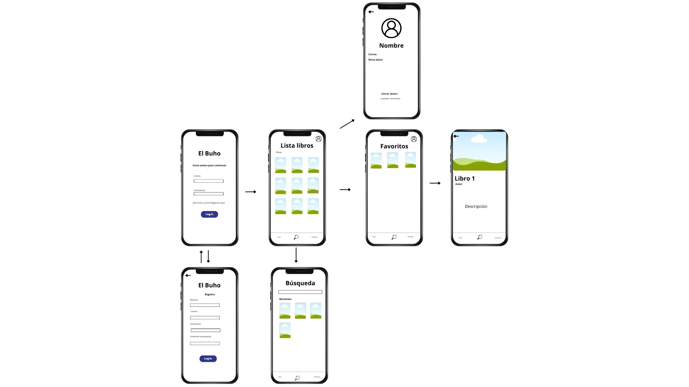

# El Buho - Prototipo de Aplicación Móvil
## Integrantes del equipo
1. Perez Hernandez Uriel Alexander
2. Corona Baez Fabrizzio Alessandro
## Descripción del Proyecto

Este proyecto ilustra el flujo de usuario principal de la aplicación, desde la autenticación del usuario hasta la visualización de los detalles de un libro específico.
---

## Flujo de Usuario y Pantallas

A continuación se detalla el recorrido principal del usuario dentro de la aplicación:

### 1. Inicio de Sesión (Login)
La pantalla de bienvenida donde los usuarios existentes pueden acceder a su cuenta. Incluye opciones para inicio de sesión tradicional (correo y contraseña) y métodos de inicio de sesión social (Apple/Google).

### 2. Registro
Si el usuario no tiene cuenta, puede acceder a esta pantalla desde el Login para crear una nueva proporcionando sus datos básicos.

### 3. Pantalla Principal (Lista de Libros)
Una vez autenticado, el usuario llega al "Home", donde se presenta una cuadrícula con el catálogo de libros disponibles. Cuenta con una barra de navegación inferior para acceder rápidamente a las secciones clave de la app.

### 4. Búsqueda
Accesible desde la barra de navegación inferior. Permite a los usuarios buscar títulos o autores específicos de manera rápida, mostrando resultados filtrados en formato de cuadrícula.

### 5. Favoritos
Sección dedicada donde los usuarios pueden consultar los libros que han marcado como favoritos para leerlos más tarde o tenerlos a mano.

### 6. Detalle del Libro
Al tocar cualquier libro en las pantallas anteriores, el usuario accede a esta vista. Muestra la portada en gran tamaño, el título, el autor, una sinopsis detallada y los llamados a la acción (como "Comprar" o "Añadir a Favoritos").

### 7. Perfil de Usuario
Accesible desde la esquina superior derecha de la pantalla principal. Aquí el usuario puede gestionar su información personal, correo electrónico y cerrar sesión.

# WireFrame

=======

